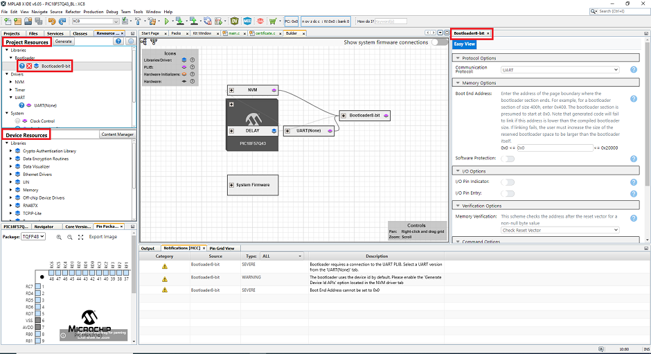

# Melody Bootloader Solution for PIC18F57Q43

## Introduction

This example uses the 8-bit Melody Bootloader library to show how to configure the bootloader on PIC18F57Q43 along with a simple LED blinking end application project. The bootloader will be programmed into the microcontroller using MPLAB X IDE and the end application will be programmed using UBHA ([Unified Bootloader Host Application](https://www.microchip.com/en-us/tools-resources/develop/libraries/microchip-bootloaders/8-bit))

## Hardware Tools

1. [PIC18F57Q43 Curiosity Nano Evaluation Kit](https://www.microchip.com/en-us/development-tool/DM164150)
2. USB 2.0 A-Male to Micro B Cable

## Software Tools

1. [MPLAB X IDE v6.00 or later](https://www.microchip.com/en-us/tools-resources/develop/mplab-x-ide#tabs)
2. [MPLAB Code Configurator (Plugin) v5.1.17 or later](https://www.microchip.com/en-us/tools-resources/configure/mplab-code-configurator)
3. [XC8 Compiler v2.40 or later](https://www.microchip.com/en-us/tools-resources/develop/mplab-xc-compilers/downloads-documentation#XC8)
4. Melody Core v5.4.3 or later
5. [Java Runtime Environment version 1.8.0_25 or older](https://www.oracle.com/java/technologies/javase/8u251-relnotes.html)
6. Unified Bootloader Host Application ([UBHA](https://www.microchip.com/en-us/tools-resources/develop/libraries/microchip-bootloaders/8-bit))

## Library Dependencies
1. UART v1.8.0 or later
2. Timer(Delay) v3.0.5 or later
3. NVM v6.0.0 or later
4. PIC10/PIC12/PIC16/PIC18 Device Library v5.12.0 or later

## Related Documentation

1. [PIC18F57Q43 Datasheet](https://www.microchip.com/en-us/product/PIC18F57Q43)
2. [Melody Bootloader v3.0.1  User's Guide](https://onlinedocs.microchip.com/oxy/GUID-C6916C91-B44E-4984-8A69-9C06B0E156FD-en-US-1/GUID-41C493BE-EE53-476B-B0B0-D106F168BCAD.html)
3. [MCC Melody Technical Reference](https://onlinedocs.microchip.com/pr/GUID-5A03F818-B7FC-4062-9792-57D08543B586-en-US-4/index.html?GUID-4FF6C8DE-2375-4456-9150-3ECCDAEB82B4)
4. Hexmate User Guide (Under the XC8 installation folder)    
  
5. [MCC AVR and PIC16/18 Generic Bootloader Library Release Notes](https://onlinedocs.microchip.com/oxy/GUID-41B03AED-93FD-4454-BD01-4532EE71B9B5-en-US-2/GUID-47CBF3EF-7415-4F80-B0F4-E972F464D8F0.html)
6. [Bootloader 8-bit library changelog](https://www.npmjs.com/package/@mchp-mcc/bootloader-8bit?activeTab=readme)

## Setup

The PIC18F57Q43 Curiosity Nano Development Board is used as the test platform. To setup the board, connect the device to the PC using the USB cable before proceeding with the project.   

# Bootloader Overview

  1. Open the bootloader project PIC18F57Q43_BL.X in MPLAB X IDE. Right Click on PIC18F57Q43_BL.X and Set as Main Project.   
  

  2. Open MCC from the toolbar.  
  

  3. Open CLKCTRL from System module in the Project Resources tab. Make sure the Clock source is configured. In general, faster is better for more reliable communication.  
  

  4. Open the Bootloader8-bit driver under the Libraries section in the Project Resources tab. If the Bootloader driver is not available in the Project Resources, add it to the project by double clicking on it under Device Resources. If you cannot see the Bootloader module in the Device Resources, navigate to the library release notes and follow the steps located in the Installing MCC Melody Bootloader 8-Bit Library section.   
   

  5. Open UART module. Make sure UART1 is selected from the UART PLIB Selector drop down list.   
  

  6. Open UART1_Peripheral tab from the Builder window. Make sure UART, UART Receiver and UART Transmitter are enabled.   
  
  
  7.  Now configure the Bootloader8-bit module. Configure the necessary options for your project and select the Memory Verification scheme to be used.
  Also configure the offset for the bootloader firmware. The remaining space in the flash after the offset will be populated with the End Application code. For PIC18F57Q43 device, a minimum offset of 3000h is required.   
    

  8. Flash memory is divided into two areas by using the offset value. One is the bootloader section and the other is the end application section.

     | Memory Region                                | Memory Size                                                              |
     | -------------------------------------------- | ------------------------------------------------------------------------ |
     | Program Memory Flash for PIC18F57Q43         | 128k bytes                                                               | 
     | Rom range allocated(offset)/Bootloader Area  | 0 to 0x2fff = 0x3000 bytes                                               |
     | End Application Space                        | Program Memory Size - Bootloader Area = 0x20000 - 0x3000 = 0x1D000 bytes |

      Make note of these values. We will later use these values in the linker settings of the application project.   

      

  9. Open Delay driver from Timer module in the Project Resources tab. Generate delay driver is ON by default.   
  

  10. For the NVM driver, make sure Generate Flash APIs, Generate EEPROM APIs, Generate Device ID APIs and Generate Configuration Settings APIs are enabled.   
  

  11. Open the Pin Grid View. RF3 is used for the Bootloader Indication pin (output), RB4 is the Bootloader Entry pin (input), Tx and Rx are on RF0 and RF1. Select the Pin Module from the project resources, System option. Pins are configured to digital by deselecting the analog check box option for all the pins used. Start high is enabled for BL_INDICATOR (RF3) pin.   
  

  12. Press 'Generate' to generate the project code. Make sure the generation is completed successfully.   
  

  13. Next step is to configure the project properties. This can be opened by selecting "File->Project Properties". Select "PIC18F57Q43 Curiosity Nano" under Connected Hardware Tool, DFP version under Packs and the XC8 version under compiler toolchain.   
  

  14. We have completed the needed configurations for the Bootloader project. Clean and build the project by clicking the Clean and Build Main Project button on the toolbar.   
  

  15. Program the device by clicking "Make and Program Device Main Project" button on the toolbar. Once the bootloader is programmed into the device successfully, you should see the device LED ON.   
  

## End Application

The end application really depends on what the customer wants the microcontroller to do. For testing purposes, it can be something as simple as a blinking LED. The example here will be for a PIC18F57Q43 Curiosity Nano. However, it is practically the same procedure for all devices, the only thing that changes is the pin configuration which can be easily figured out from the schematics and datasheets.

  1. Open the end application project PIC18F57Q43_App.X in MPLAB X IDE. Right Click on PIC18F57Q43_App.X and Set as Main Project.   
  

  2.  Open MCC from the toolbar.   
  
  
  3. Open CLKCTRL from System module in the Project Resources tab. Make sure the Clock bits are configured to the settings observed in the bootloader. This will help during testing to prevent the configuration bits from causing a Checksum mismatch with UBHA.   
  

  4. On-board LED is configured by setting RF3 as output pin.   
  

  5. Delay timer is used to add a delay between toggling the LED.  
  

  6. Press 'Generate' to generate the project code. Make sure the generation is completed successfully.      
  

  7. For a blinking LED application, add the following code is added to main.c in Source Files under the project folder. The delay.h header file must also be included in the main file.   
  
  
  8. Certificate.c file reserves the last 4bytes of the Flash memory and writes them with 0xFFFFFFFF. This is later updated with the correct Checksum or CRC value calculated during the post build step.   
  
  
  9. Next step is to configure the project properties. This can be opened by selecting "File->Project Properties". Select "PIC18F57Q43 Curiosity Nano" under Connected Hardware Tool, DFP version under Packs and the XC8 version under compiler toolchain.   
    

  10. For the end application project, we also need to configure the linker setting for the verification scheme used. Please checkout the Compiler and Linker Settings section for the details.

  11. We have completed the needed configurations for the end application project. Compile and build the project by clicking the Clean and Build Main Project button on the toolbar.

  12. The application HEX can be loaded on the microcontroller through Microchip's Unified Bootloader Host Application(UBHA).

## Compiler and Linker Settings
 
The following section is intended to provide an explanation of the compiler and linker settings utilized in the PIC18F57Q43 Application project. These settings are already configured in the examples, this is simply here to provide a depth of understanding and to provide help incase you want to try setting a new size.

Checksum, CRC16, CRC32 and Offset (Reset Vector and Status Flag) verification schemes are supported by the Bootloader library. The example below uses the Checksum verification scheme for demonstration. For more details, refer to the Melody Bootloader User's Guide.

### Linker > Additional Options
 #### Note: More information on the linker settings can be found in the Hexmate User Guide
Codeoffset = 3000h 
Checksum = 3000-1FFFD@1FFFE,width=-2,algorithm=2

| Value      | Description                                                                        |
|----------- |------------------------------------------------------------------------------------|
| 3000       | Bootloader offset value                                                            |
| 1FFFD      | Program Memory Size                                                                |
| Width      | Width of Checksum - This value is used because the checksum calculated is 2 bytes. It will occupy the last 2bytes of the Program Memory.For CRC32, checksum value is 4 bytes and CRC16 & Checksum value is 2 bytes |
| 1FFFE      | Checksum value will be stored here for 2bytes                                      |
| algorithm  | Checksum verification schemes algorithm value                                      |
| polynomial | Hexadecimal value used when calculating CRC. For more information, refer the Melody 8-bit Bootloader_VerificationSchemas section in the Melody Bootloader User's Guide |

Linker Additional Setting for the verification schemes:

|Verification Scheme | Linker Additional Settings                                                 |
|------------------- | -------------------------------------------------------------------------- |
| CRC16              | 3000-1FFFD@1FFFE,width=-2,algorithm=5,offset=FFFF,polynomial=1021          |
| CRC32              | 3000-1FFFB@1FFFC,width=-4,algorithm=-5,offset=FFFFFFFF,polynomial=04C11DB7 |
| Checksum           | 3000-1FFFD@1FFFE,width=-2,algorithm=2                                      |

## Application Hex file is programmed using the UBHA

The Unified Bootloader Host Application is a Java utility that was created to simplify the development and testing process for anyone configuring our basic bootloader. You will more than likely be writing your own host to interface with your specific bootloader firmware but UBHA will help you get started with the basic bootloader firmware present in the Melody 8-bit Bootloader Library.

The application HEX file is loaded in the controller using Microchip's Unified Bootloader Host Application. Before programming the controller with the Application HEX file, make sure the controller is programmed with the bootloader.   

 Follow the steps below to load a new firmware image onto the device.

   1. Download and Launch Unified Bootloader Host Application.   
   
   
   2. COM port for PIC18F57Q43 Curiosity Nano Board can be found out from the Device Manager.   
   

   3. Select PIC18  device architecture.   
   

   4. Configure the serial port through "Settings->Serial". Select the correct COM port and BaudRate.   
   

   5. Opening the console to get all the messages printed is ideal for debugging or communication failures. Console can be found under the 'Tools' tab.   
  

   6. Load the End application Hex file by selecting File->Open/Load File. Hex file will be present at “Application Project Folder\dist\verification_scheme\production”.   
   

   7. Set the program memory size depending on the target device. For PIC18F57Q43, the program memory size is 0x20000. Enter the offset programmed previously in the bootloader project, i.e. 0x3000. The size of every location depends on the target device. Some devices have word-addressable Flash and others have it byte-addressable. For PIC16 devices, convert the word addresses into bytes before inputing them into UBHA. (Example: 0x800 Words x 0x2 => 0x1000 Bytes).    
   
   
   8. Click on the Program Device button. Once the device is programmed, the bootloader will disconnect from the COM port and the device LED should be blinking now.   
     
